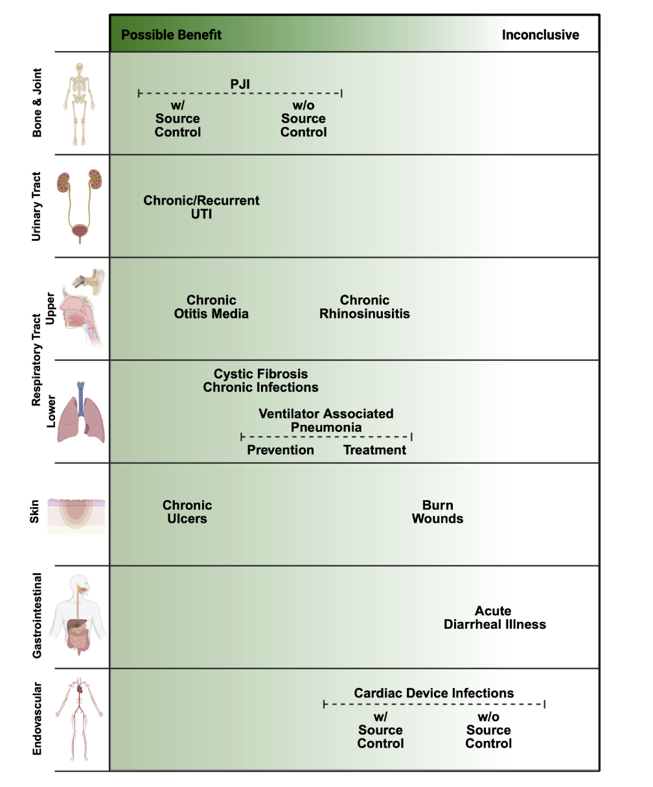

## Bacteriophages, Endolysins,   Antimicrobial Peptides & Monoclonal Antibodies {.light-text background-color="#b20e10" background-video="phage-images/background.mp4" background-video-loop="true" background-video-muted="true" background-opacity="0.4"}

**Russell E. Lewis, Pharm.D**   Associate Professor of Infectious Diseases (MEDS-10/B)  

   

{fig-align="center" width="350"}

   russelledward.lewis\@unipd.it    [https://github.com/Russlewisbo](https://github.com/Russlewisbo/ESCMID_2022_talk)   Slides and course materials: [www.idpadova.com](https://padovaid.com/)

 

## Learning objectives

 

**By the end of this session, you should be able to:**

- Explain the biology of obligately lytic vs. temperate phages and why it dictates therapeutic suitability
- Critically interpret phage susceptibility testing (plaque assay, EoP, phagogram) as a pharmacodynamic surrogate
- Reason through phage PK/PD, immunogenicity, and phage–antibiotic interactions at the bedside
- Appraise the disconnect between compassionate-use case reports and randomized trial data
- Place endolysins, antimicrobial peptides, and **monoclonal antibodies** within the same "targeted biologic" antimicrobial framework

::: notes
This is pitched at fellow level. The throughline of the whole lecture is that these are *biologic*, *narrow-spectrum*, *self-amplifying or non-replicating* agents whose pharmacology breaks the small-molecule rules you already know. Keep returning to the PK/PD and immunology, because that is where the field is genuinely unsettled.
:::

## Why now? The post-antibiotic anxiety

 

- Infectious disease caused \~1/3 of deaths in Western countries in 1900;   the antibiotic "golden era" (1950–70) reversed this
- New class discovery has stalled while resistance accelerates
- Bacterial AMR was associated with **\~4.95 million deaths** (1.27 million attributable) in 2019; projections approach **10 million/year by 2050**
- *S. aureus* sepsis mortality fell from \~85% (pre-antibiotic) to \~23%, but MRSA bacteremia mortality remains high

::: aside
The development of phages, lysins, AMPs and mAbs are responses to a market and scientific failure: small-molecule discovery is economically broken. Note the projection figure is contested but rhetorically dominant [@GBDAMR2022; @Cosgrove2003; @Silver2011; @Fair2014].
:::

## Four platforms, one logic

 

| Platform | Nature | Replicates? | Spectrum |
|------------------|------------------|------------------|------------------|
| Bacteriophages | Lytic virus | **Yes**   (self-amplifying) | Very narrow (strain) |
| Endolysins | Phage-derived enzyme | No | Narrow–moderate |
| Antimicrobial peptides | Small cationic peptide | No | Broad (often) |
| Monoclonal antibodies | Host-type IgG | No | Very narrow (epitope) |

: **Targeted biologic antimicrobials at a glance**

# Bacteriophages- A Brief History {background-color="#b20e10"}

## Discovery: Hankin, Twort, d'Hérelle

 

::::: columns
::: {.column width="35%"}
{fig-align="center" width="250"}
:::

::: {.column width="65%"}
- 1896 — Hankin describes antibacterial "substance" in the Ganges/Jumna passing through filters and killing *Vibrio cholerae*; later analyses doubt phages were the agent
- 1915 — Twort reports "ultramicroscopic" lytic agent
- 1917 — **d'Hérelle** gives unambiguous evidence of a replicating, bacteria-dependent organism; coins *bacteriophage* ("to devour bacteria")
- First plaque assay and first quantification of titer described in the same lineage
:::
:::::

     

::: aside
d'Hérelle is the central figure: he both discovered and immediately therapeutically deployed phages. The anti-Shiga "microbe" was isolated from filtered stool of recovering shigellosis patients.[@Hankin1896; @Twort1915; @dHerelle1917; @Abedon2011]
:::

## Eclipse and survival in the East

::::: columns
::: {.column width="50%"}
{fig-align="center" width="400"}
:::

::: {.column width="50%"}
- First published therapeutic use \~4 years after d'Hérelle's discovery; he personally treated many patients
- Penicillin and the antibiotic era eclipsed phage therapy in the West
- Narrow host range, lack of pharma interest, and geopolitics shifted research to chemotherapeutics
- Phage therapy persisted in **Eastern Europe and the former Soviet Union** (Eliava Institute, Tbilisi) and is still used there
:::
:::::

   

::: aside
The West assumed new drug classes could be discovered to outrun resistance. That assumption failed, which is why the field looks East for a century of empirical experience — albeit poorly standardized by modern trial standards [@dHerelle1931; @Summers2012; @Chanishvili2012].
:::

## The modern resurgence

 

- AMR threat has driven renewed interest as a self-amplifying, self-limiting "drug"
- An estimated **10³¹ phage particles** on Earth — a near-inexhaustible, biodiverse resource
- High-profile compassionate-use successes (Patterson/*Acinetobacter*, 2017) catalyzed Western academic programs
- Trajectory now hinges on translational PK/PD research and **well-designed clinical trials**

::: aside
[@Kortright2019; @Mushegian2020; @Schooley2017]
:::

::: aise
The 2017 Schooley/Patterson case at UCSD is the inflection point for US academic phage therapy and led to IPATH. However, enthusiasm currently outstrips controlled evidence.
:::

# Phage Biology {background-color="#b20e10"}

## Diversity and taxonomy

 

- Most abundant biological entity on Earth (\~10³¹ particles)
- As of 2022, **1653 phage genera** recognized by the ICTV
- Only \~6300 phages examined by EM; \~14,200 sequenced — most with **dsDNA** genomes
- Classical morphology-based families (*Siphoviridae*, *Myoviridae*, *Podoviridae*) now reorganized; morphology terms persist descriptively

::: aside
[@Mushegian2020; @Walker2022; @Ackermann2012]
:::

::: aside
International Committee on Taxonamy of Viruses (ICTV) abolished the Siphoviridae/Myoviridae/Podoviridae families (Caudovirales reclassification). This presentation uses these names descriptively for sheath morphology, which is still pedagogically useful.
:::

## Anatomy of a tailed phage

{fig-align="center" width="800"}

   

::: aside
Tail fibers are the receptor-binding proteins — remember this when we get to resistance (receptor loss) and engineering (tail-fiber swapping to expand host range) [@Nobrega2018; @Ackermann2012]
:::

## Lytic vs. lysogenic life cycles

{fig-align="center" width="650"}

   

::: aside
Temperate phages can mediate lysogenic conversion (e.g., Shiga toxin, cholera toxin, diphtheria toxin are all prophage-encoded). Hence sequence and confirm lytic lifestyle before clinical use [@Hobbs2016; @HowardVarona2017; @Monteiro2019].
:::

## Adsorption: not just Brownian luck

 

- Encounters are largely **Brownian/stochastic** — phages are non-motile

- Reversible binding precedes irreversible binding and injection

- Phages can "**walk**" or "roll" across the surface to find an injection site

- Mucus-associated subdiffusive motion (Ig-like capsid domains binding mucin) raises encounter frequency at mucosal surfaces

     

::: aside
The Barr "bacteriophage adherence to mucus" (BAM) model reframes phages as a mucosal innate-immune layer and has implications for inhaled/oral delivery[@Nobrega2018; @Hu2013; @Barr2013]. Phages — particularly those displaying an Ig-like (immunoglobulin-like) domain on their capsid proteins, such as Hoc in phage T4 — adhere to mucin sugar chains within the mucus layer. Adherence creates a localized zone of increased phage density at the mucosal surface, which raises the odds that an invading bacterium will encounter and be infected/killed by a phage before it can breach the mucus and reach the underlying epithelium.
:::

# Spectrum & Susceptibility Testing {background-color="#b20e10"}

## Why we must test every isolate

 

- Narrow host range means **no assumed susceptibility** — test against each clinical isolate
- Best suited to **monomicrobial** infection; polymicrobial sites (diabetic foot, intra-abdominal) are harder
- If multiple strains of one species are present, test each strain
- This is the operational bottleneck that makes phage therapy a *personalized* intervention

::: notes
Contrast with antibiotic susceptibility: with phages there is no species-level breakpoint you can extrapolate. Every isolate is its own experiment. This is the logistical reality that limits scalability today [@Suh2022].
:::

## Testing spectrum and activity of phages

{fig-align="center"}

## The plaque assay and efficiency of plaquing

 

::::: columns
::: {.column width="50%"}
{fig-align="center" width="400"}
:::

::: {.column width="50%"}
- Lawn of clinical isolate + serial phage titers → **zones of clearance (plaques)**
- **EoP** = titer producing plaques on the clinical isolate ÷ titer on the propagation host
- A pharmacodynamic surrogate analogous to MIC; allows ranking of candidate phages
- An **EoP ≥ 0.1** appears associated with better outcomes (thresholds still provisional)
:::
:::::

::: aside
Propogation host- specific bacterial strain used to grow (amplify) a bacteriophage stock; usuallly the strain the phage was originally isolated on or a starndard reference strain. EoP is the closest thing to a "susceptibility breakpoint" but it is not standardized across labs, and plaque morphology, multiplicity of infection, and propagation host all influence it. Treat thresholds skeptically [@Suh2022].
:::

## Spot testing

{fig-align="center"}

## Phagograms

{fig-align="center"}

## Spot tests and phagograms

 

- **Dilutional spot test:** spot decreasing titers on a lawn; compare candidate phages in one assay
- **Phagogram:** co-incubate fixed phage + bacteria, track optical density/respiration vs. growth control over \~24 h
- Time course mirrors broth microdilution kinetics used for antibiotic MICs
- Higher-throughput readouts (e.g., OmniLog respirometry) enable rapid screening

::: aside
Phagograms are the most "PD-like" assay because they capture suppression over time, including regrowth from resistant subpopulations — which a single plaque count misses [@Suh2022; @Henry2012].
:::

## Testing for combinations — before the bedside

 

- Phage therapy is usually given **with antibiotics** — confirm no antagonism, ideally synergy
- For biofilm indications, test anti-biofilm activity against the clinical isolate in vitro first
- Combination/cocktail design should be deliberate, not ad hoc
- In vitro testing for synergy/antagonism between selected antibiotics and phages is a recommended step

::: aside
This sets up the later "therapeutic phage interactions" section. The key practice point: you screen not just phage-vs-bug but phage-vs-antibiotic-vs-bug [@Suh2022; @Doub2020biofilm; @Merabishvili2018].
:::

# Bacterial Resistance to Phages {background-color="#b20e10"}

## Resistance is the default, not the exception

 

- \~10^25^ phage infections per second in the ocean; 20–40% of marine bacteria killed daily
- Enormous selective pressure has produced layered anti-phage defenses
- Spontaneous phage-resistant mutants arise at \~10⁻⁵ (range 10⁻⁹–10⁻²)
- Clinically, the question is not *whether* resistance emerges but whether it carries a **fitness cost** we can exploit

::: notes
Reframe resistance as a feature, not only a bug: because phage receptors are often virulence factors, resistance frequently comes at a cost. This is the conceptual bridge to phage steering later [@Suttle2007; @Brussaard2008; @Labrie2010; @Filippov2011].
:::

## Mechanism #1- Receptor modification   — and its trade-off

 

- Most common mechanism: **alteration or loss of the phage-binding receptor**
- Receptors are often virulence factors or efflux/porin components, so resistance can shift **antibiotic susceptibility** too
- Phage-resistant mutants are frequently **less virulent**
- The most common resistance route may yield bacteria that are easier to treat — a therapeutic silver lining

::: aside
[@Labrie2010; @Filippov2011; @Chan2016; @GordilloAltamirano2021]
:::

::: aside
The Chan 2016 OMKO1 / Pseudomonas example: resistance via the OprM efflux porin restores sensitivity to ceftazidime/ciprofloxacin. This is the canonical "evolutionary trade-off" story and underpins phage steering.
:::

## Mechanism #2: Abortive infection and CRISPR-Cas

 

- **Abortive infection (Abi):** infected cell commits altruistic suicide (DNA/membrane degradation) before progeny mature — kin selection
- **CRISPR-Cas:** adaptive immunity in \~40% of sequenced bacteria; spacers guide Cas nucleases to phage DNA
- Other layers: restriction-modification, CBASS/cyclic-nucleotide signaling, superinfection exclusion
- Pre-clinical **screening** of each clinical isolate sidesteps most defenses at the patient level

::: aside
The practical reassurance is that you screen the actual isolate, so you only deploy phages that already work against it. The anti-phage "pan-immune system" is an explosively active research area [@Labrie2010; @vanHoute2016; @Makarova2020].
:::

## Mitigating resistance: cocktails and cycling

 

- **Cocktails:** combine phages using **different receptors** to raise the barrier to resistance
- **Sequential therapy:** rotate phages of differing antigenicity (also mitigates neutralizing antibody)
- Cocktails must be designed for **no inter-phage antagonism** (receptor competition, CRISPR upregulation)
- "**Phage training**" — experimental coevolution to pre-adapt phages — delays resistance

::: aside
Cocktails raise the resistance barrier but complicate manufacturing, regulatory filing, and interaction testing. Precision-designed cocktails beat "throw everything in" cocktails [@Merabishvili2018; @Lusiak2014; @Borin2022].
:::

# Phage Manufacturing, Logistics    & Regulation {background-color="#b20e10"}

## From sewage to sterile vial

::::: columns
::: {.column width="50%"}
{fig-align="center" width="450"}
:::

::: {.column width="50%"}
- Discovery sources: wastewater, environmental water, anywhere bacteria are abundant
- For ESKAPE pathogens a matching phage is often found quickly; for rare isolates it may take **months or never**
- Candidate phages are **sequenced and characterized**: confirm obligately lytic; exclude toxin/resistance/integrase genes
- Amplified on bacterial hosts to reach therapeutic titers  
:::
:::::

   

::: aside
 

Because phages are grown on bacteria, the manufacturing problem is fundamentally a *contaminant* problem — you are purifying a virus away from a lysed bacterial culture [@Suh2022; @Doub2021b; @Doub2021].
:::

## Timeline to produce bacteriophage therapy

{fig-align="center"}

## Endotoxin and the contaminant problem

 

- Bacterial lysis releases **endotoxin** — FDA limit **5 EU/kg/dose**
- Removal: ultrafiltration, affinity and ion-exchange chromatography
- Other risks: prophages, pathogenicity islands, toxins, mobile genetic elements from the propagation host
- Mitigation: amplify on a **clean surrogate host** (e.g., *S. carnosus* or *S. aureus* RN4220) rather than the clinical isolate

::: aside
The RN4220/S. carnosus trick is elegant: propagate on a genetically "clean" relative so you don't co-purify the clinical isolate's toxins and MGEs. Sterility testing for residual live bacteria/fungi is also mandatory [@Hietala2019; @Doub2021b].
:::

## Stability, storage, and formulation

 

- Frozen at −80 °C with **glycerol** cryoprotectant; or 4–6 °C; or lyophilized for ambient storage

- Shelf life can be **years** with proper storage

- Diluted for use in Plasma-Lyte, normal saline, or other fluids — **compatibility is phage-specific**

- Always confirm retained activity in the chosen diluent before administration

::: aside
Practical pearl: a phage stable in saline may be inactivated in another buffer. There is no universal formulation — each preparation needs its own compatibility check [@Duyvejonck2021; @Puapermpoonsiri2010].
:::

## Regulatory pathway (EU vs. US)

 

- Phage therapy is **not FDA-approved**; use is via clinical trial or **compassionate use** after conventional failure
- **No EU-wide authorised human phage medicinal product** under EU law.
- Per-case **emergency IND (eIND)** or expanded-access IND required
- Emergent eIND can be granted rapidly once a phage is identified; non-emergent \~4 weeks
- Europe: magistral preparations (Belgium) and named-patient frameworks offer alternative routes

::: aside
The regulatory mismatch is central: a personalized, evolving, biologic product does not fit a framework built for fixed small molecules. Belgium's magistral pathway is the most-cited pragmatic workaround [@McCallin2019; @Suh2022; @Fauconnier2019].
:::

# Phage Pharmacokinetics & Pharmacodynamics {background-color="#b20e10"}

## Phages break small-molecule PK rules

 

- Large, proteinaceous, **self-replicating**, and interactive with host immunity
- Concentration at the target can *increase* where bacteria are present (auto-dosing) then fall as bacteria clear
- "Dose" is entangled with bacterial density, burst size, and adsorption rate
- Routes: oral, intravenous, inhaled, and **direct** application

::: aside
This is the conceptual heart of phage PK: the drug amplifies itself at the site of infection and is cleared when its substrate (bacteria) disappears. Classic Cmax/AUC thinking only partly applies [@DabrowskaAbedon2019; @Suh2022].
:::

## Oral and the GI gauntlet

 

- Proposed absorption via transcytosis across epithelial tight junctions — limited by phage size
- Vulnerable to gastric **pH \<6**, mucins, and immune clearance
- Mitigation: co-administer with an alkaline/antacid buffer
- Systemic absorption after oral dosing is **inconsistent**, though phages are recoverable in blood/urine/tissue

::: aside
Oral works best for enteric targets; expect poor and erratic systemic levels. The Nguyen transcytosis paper provides a mechanism but the magnitude is small [@Nguyen2017; @Dabrowska2019].
:::

## Intravenous: fast in, fast out

 

- Phages detectable in circulation soon after IV dosing, then **cleared within 8–12 h** by the mononuclear phagocyte system

- Distributes to synovium, heart, muscle, marrow, kidney, bladder — dose-dependent

- Site concentrations are typically **several-fold lower** than the input titer

- IV most strongly stimulates **neutralizing antibody** and complement

::: aside
The reticuloendothelial/MPS clearance is the dominant elimination route and the reason repeat or continuous dosing is often used. It also primes the humoral response that can neutralize later doses [@Dabrowska2019].
:::

## Direct and inhaled administration

 

- **Direct** (intra-articular, intravesical, intra-operative, topical) bypasses the MPS → higher local, lower systemic titers

- Used for PJI, CIED, osteomyelitis, UTI in case reports

- Controlled-release (hydrogels, microencapsulation) under study

- **Inhaled** phages for respiratory infection; lung-specific clearance/barriers still being defined

::: aside
Direct administration is favored for biofilm/device infections precisely because it bypasses MPS clearance and maximizes local titer at a site where chance encounters with sessile bacteria are limiting [@Totten2021; @Suh2022; @Dabrowska2019]. PJI- prosthetic joint infection; CIED- cardiac implantable electronic device — i.e., pacemakers, implantable cardioverter-defibrillators, and similar devices,
:::

## Dosing: empirical, with rare rationale

 

- Regimens range from single doses to multiple daily dosing to continuous infusion — mostly **empirical**
- One rational example: **twice-daily IV** based on detectable phage DNA up to 12 h post-dose
- Multi-route administration is often combined to overcome single-route barriers
- ARLG Task Force: use the **highest safe, tolerated dose** with endotoxin below limits; repeat dosing to maximize site levels

::: aside
The honest message: dosing is not yet evidence-based. The Fabijan twice-daily regimen is the rare example where PK data actually informed the interval [@Suh2022; @Fabijan2020].
:::

## ARLG ideal PK/PD properties

 

A favorable phage product should combine:

- High microbial susceptibility (low EoP threshold met)

- High local **concentration at the site of infection**

- High **adsorption rate** (infectivity)

- Large **burst size** (progeny per infected cell)

- Short **latent period** (replication time within the cell)

::: aside
These five parameters are the ARLG's attempt to define a phage "PD profile." Standardized methods to measure them in vivo do not yet exist — a key research gap the task force itself flags [@Suh2022].
:::

# Immunogenicity {background-color="#b20e10"}

## The neutralizing antibody response

 

- Phages are live viruses → IgM within weeks, followed by IgG
- Neutralizing antibodies can sharply reduce phage titers and **correlate with clinical failure** [@Dedrick2022]
- **Cocktails do not solve this** — antibodies form against all component phages, with cross-reactivity
- Not universal: some prolonged courses do **not** generate neutralizing titers

::: aside
The Dedrick 2021 Nature Medicine case is the cautionary tale: a pulmonary M. abscessus infection where rising neutralizing antibody limited efficacy. This is arguably the most underappreciated PD problem in the field [@Lusiak2014; @Dedrick2021; @Cano2021].
:::

## Route matters for immunogenicity

 

- **IV** elicits the most robust humoral response; oral and direct elicit less
- Direct administration → lower neutralizing titers, rising with systemic absorption
- Autoimmune phenomena are theoretical and not described with phage therapy to date
- **Sequential** therapy with antigenically distinct phages can outpace antibody — but narrow inventories limit cycling

 

::: aside
Practical implication: for a device or joint infection, direct intra-articular delivery is doubly attractive — it bypasses MPS clearance and minimizes the neutralizing antibody response [@Lusiak2014; @Smatti2019].
:::

# Phage–Antibiotic   & Phage–Phage Interactions {background-color="#b20e10"}

## Synergy, antagonism, or neutrality

 

- Phages + antibiotics can be **synergistic, antagonistic, or neutral**
- General rule: **cell-wall agents → synergy**; **protein-synthesis inhibitors → potential antagonism**
- "**PAS**" (phage–antibiotic synergy): sub-MIC β-lactams/quinolones can stimulate virulent phage production
- But responses are phage- and antibiotic-specific — general rules are only a starting point

 

::: aside
PAS mechanism: filamentation from cell-wall stress increases phage burst size. The Gu Liu 2020 mBio paper shows synergy depends on mechanism *and* stoichiometry — so empirical testing beats dogma [@Gu2022; @Comeau2007PAS].
:::

## When combinations backfire

 

- **Colistin + LPS-binding phages:** colistin destabilizes LPS, the very receptor the phage needs → antagonism
- Burst size, pH, viscosity, and fluid dynamics all modulate interactions
- Scoring systems have been proposed but **in vitro testing of the actual pair is essential**
- Bottom line: confirm the specific phage–antibiotic combination empirically before use

::: aside
The colistin example is the cleanest teaching case of mechanistic antagonism: the antibiotic and phage compete for / destroy the same molecular target [@DanisWlodarczyk2021; @Gu2022].
:::

## Phage–phage interactions in cocktails

 

- Phages can interfere with one another — reduced activity of each
- Drivers: competition for **shared receptors** and **CRISPR-Cas upregulation**
- Interactions are unpredictable → evaluate combinations individually
- Argues for **precision-designed** cocktails over ad hoc mixtures

::: notes
Same theme as resistance mitigation: a well-designed cocktail uses non-competing receptors and confirmed non-antagonism. "More phages" is not automatically "more killing" [@Merabishvili2018].
:::

# Safety {background-color="#b20e10"}

## A reassuring overall profile

 

- Generally favorable safety across preclinical, case-report, and phase I/II data
- FDA has granted **GRAS** status for certain phage applications
- Phages are part of the human gut **virome** — ubiquitous baseline exposure
- ARLG nonetheless recommends interval monitoring of **renal/liver function and CBC** during therapy

::: aside
Generally Recognized As Safe (GRAS)

The ecological argument for safety is strong — we ingest billions of phages daily — but it should not substitute for monitoring, especially given endotoxin and cytokine concerns with rapid lysis [@Merabishvili2018; \@Liu2021; @FDAGRAS; @Townsend2021; @Suh2022].
:::

## Mechanisms of adverse events

 

- **Endotoxin/bacterial debris** release from rapid lysis → proinflammatory cytokine response
- Contaminants: bacterial DNA, enterotoxins, exotoxins, lipoteichoic acid → hypersensitivity/cytokine release
- Manufacturing residues: cesium chloride, polyethylene glycol
- Net effect on the microbiome is narrow vs. antibiotics but **understudied**

::: aside
Lysis-associated cytokine release is the mechanistic worry analogous to a Jarisch-Herxheimer reaction — relevant in high-burden bacteremia where you lyse a large bacterial load quickly [@Liu2021].
:::

## Adverse events in practice

 

- Preclinical: generally well tolerated; occasional cytokine (IL-1β/IL-6) or IgG/IgM rises without clinical change
- Case reports: mostly none or transient — transient hypotension, fevers/chills, wheeze, flushing, nausea
- Self-limited **IL-6/IL-8 cytokine storm** resolving in \~1 day reported
- Transient **transaminitis** with IV/intra-articular dosing; reversible, outcomes still favorable

::: aside
The transaminitis signal (Doub & Wilson) is worth flagging for fellows managing real cases — monitor LFTs, especially with pre-existing liver disease, but it has generally been reversible and not outcome-limiting [@Aslam2019; @DoubWilson2021; @Liu2021].
:::

# MDR Infections & Phage Steering {background-color="#b20e10"}

## Phages against drug-resistant bacteria

 

- Resistance to antibiotics does **not** confer resistance to phages — different targets (surface receptors)
- Most case reports use phages **with** antibiotics, not as monotherapy
- Narrower microbiome impact than broad-spectrum antibiotics — less collateral resistance selection
- Efficacy in MDR infection will only be settled by **prospective trials**

::: aside
The decoupling of antibiotic and phage resistance is the core rationale for MDR use. But remember the honest caveat: combination use makes attribution of benefit to the phage difficult in uncontrolled cases [@Kortright2019; @Schooley2017; @Aslam2019].
:::

## Phage steering: weaponizing the trade-off

 

- **Phage steering** drives bacteria toward a more susceptible phenotype [@Gurney2020]
- *P. aeruginosa*: selection for phage resistance via efflux/porin restores **antibiotic** susceptibility [@Chan2016]
- Can even re-sensitize to drugs not normally used (e.g., tetracyclines for *Pseudomonas*) [@Gurney2020]
- *Klebsiella* and *Acinetobacter*: phage resistance entails loss of capsule/MDR and re-sensitization [@Majkowska2021; @GordilloAltamirano2021]

::: aside
[@Gurney2020; @Chan2016; @Majkowska2021; @GordilloAltamirano2021]
:::

::: aside
Steering reframes the therapeutic goal: you may not need the phage to clear the infection outright — you need it to bend the population back into the reach of a cheap antibiotic. This is one of the most intellectually exciting ideas in the field.
:::

# Biofilm Infections {background-color="#b20e10"}

## Why phages suit biofilms

 

- Most bacteria live in **sessile biofilm** states, not planktonic [@Doub2020biofilm]
- Phages encode **depolymerases** and endolysins that degrade the extracellular polymeric matrix [@ChanAbedon2015]
- Confined biofilm environment can **increase** chance phage–bacteria encounters [@Doub2020biofilm]
- Can infect metabolically reduced cells, degrading biofilm piecemeal [@ChanAbedon2015]

::: aside
[@Doub2020biofilm; @ChanAbedon2015]
:::

::: notes
Depolymerases are a distinctive phage advantage over antibiotics for device/biofilm infection — they actively dismantle the matrix rather than merely failing to penetrate it.
:::

## Delivery determines biofilm success

 

- Direct administration reduces biofilm; **systemic** administration often does not reach device biofilm
- Murine PJI: IP phage + vancomycin synergized against planktonic bacteria but **not** the implant biofilm
- Phages are non-motile → maximize **chance encounters** by delivering directly to the biofilm
- Clinical case series support phages as a powerful **adjuvant** in recalcitrant biofilm infection

::: aside
The Morris study is the clearest demonstration that route is everything for biofilm/device infection — systemic dosing failed to reach the implant despite synergy in tissue. This justifies intra-operative and intra-articular delivery for PJI [@Morris2019; @Doub2020biofilm; @Ferry2018].
:::

# Clinical Trials: The Reality Check {background-color="#b20e10"}

## Case reports vs. controlled trials

 

- Numerous **case reports** show promise across syndromes and pathogens
- *M. abscessus*: favorable response in **11/20** compassionate-use patients
- Since 2000, **13 English-language trials**; 6 assessed efficacy
- Controlled trials have **not** reproduced the dramatic case-report outcomes

::: notes
Publication bias inflates the apparent success of case reports. The trials are where enthusiasm meets reality, and so far reality has been sobering [@Schooley2017; @Dedrick2022; @Stacey2022].
:::

## Early efficacy signals

 

- **Wright 2009** (chronic *P. aeruginosa* otitis): single 6-phage cocktail, PST-confirmed → improved clinical scores and lower *P. aeruginosa* counts vs. placebo
- The first modern **randomized, double-blind, placebo-controlled** phage trial
- Small (n≈24) and single-center, but a genuine positive efficacy signal

::: aside
Wright remains the most cited "positive" RCT — note that it confirmed susceptibility (PST) before enrollment, a design feature later "negative" trials often lacked [@Wright2009].
:::

## The instructive failures

 

- **Rose 2014** (burn wounds): fixed (non-personalized) cocktail, no prospective PST; no bacterial-load difference; spray ran off the wound
- **Sarker 2016** (pediatric *E. coli* diarrhea, Bangladesh): oral T4-like coliphages, no PST; **no clinical efficacy**, no intestinal amplification
- Recurring culprits: **fixed cocktails, no susceptibility testing, inadequate coverage, delivery failure**

::: aside
The pattern is diagnostic: the negative trials violated the very principles (personalization, PST, adequate local delivery) that the case reports followed. The failures are arguably about trial design, not phage biology [@Rose2014; @Sarker2016; @Stacey2022].
:::

## PhagoBurn and the delivery problem

 

- **Jault 2019 (PhagoBurn):** RCT of a *P. aeruginosa* phage cocktail vs. standard care in burn wounds

- Phages **slower** to reduce bacterial burden than standard-of-care antiseptic

- Manufacturing reduced titer over storage → **under-dosing**; some isolates resistant at low residual titer

- A landmark in showing how **CMC/manufacturing** can sink a phage trial

::: aside
PhagoBurn is the cautionary CMC tale: the delivered titer dropped far below intended because of stability problems, so the trial tested an underpowered dose. Manufacturing rigor is a clinical-efficacy issue, not just a regulatory one [@Jault2019].
:::

## Intravesical phages and the honest null

 

- **Leitner 2021:** intravesical phages vs. antibiotics vs. placebo for UTI before TURP

- Phages were **not superior** to placebo and **not non-inferior** to antibiotics

- Well-designed, multi-arm, double-blind — a rigorous neutral result

- Reinforces that adjunctive, personalized, well-delivered phages remain the most defensible use today

::: aside
Leitner is methodologically the strongest "negative" trial. The field's current consensus position: phages are best viewed as a personalized adjuvant for recalcitrant/MDR/biofilm infection, pending better trials (e.g., ongoing CYPHY, and NIH-funded adaptive designs) [@Leitner2021; @Suh2022].
:::

## Selected phage clinical trials

| Study (year) | Indication | Design | Efficacy signal |
|------------------|------------------|------------------|------------------|
| Wright (2009) | Chronic *P. aeruginosa* otitis | RCT, DB, PC | **Positive** |
| Rose (2014) | Burn wound colonization | Self-controlled | Null |
| Sarker (2016) | Pediatric diarrhea | RCT, PC | Null |
| Jault / PhagoBurn (2019) | Burn wound *P. aeruginosa* | RCT | Inferior (under-dosed) |
| Leitner (2021) | UTI pre-TURP | RCT, DB, 3-arm | Null |

::: aside
One positive among the rigorous efficacy trials — and that one confirmed susceptibility first. The take-home is a design lesson as much as a biology lesson Efficacy-focused phage trials [@Wright2009; @Rose2014; @Sarker2016; @Jault2019; @Leitner2021; @Stacey2022; @Wright2009].
:::

## Summary- Where is there benefit for bacteriophage therapy?

{fig-align="center" width="400"}

::: aside
[@Stellfox2024]
:::

# Endolysins {background-color="#b20e10"}

## Enzybiotics: lysis from the outside

 

- Phage-derived enzymes that **hydrolyze peptidoglycan** → osmotic lysis
- Three classes: **glycosidases, amidases, endopeptidases**
- Gram-positive endolysins: N-terminal catalytic domain + C-terminal cell-wall-binding domain
- Gram-negative endolysins: globular, no discrete binding domain

 

::: aside
"Enzybiotics" is the umbrella term. Unlike phages, these are defined chemical entities with conventional PK — a regulatory advantage. The trade-off: no self-replication and no in-situ amplification [@Rahman2021].
:::

## The Gram-negative barrier

 

- Exogenous endolysins reach peptidoglycan readily in **Gram-positives** (thick, exposed PG)
- **Gram-negative** outer membrane blocks access to PG
- Workarounds: EDTA/weak acids to permeabilize, or **engineered "Artilysins"** fusing endolysin to a membrane-translocating peptide
- Receptor-binding-protein fusions can enable Gram-negative killing

::: aside
The OM barrier is why endolysins are, for now, mostly a Gram-positive story. Artilysins (Briers/Lavigne) are the leading engineering strategy to break into Gram-negatives [@Loessner2005; @Rahman2021; @Zampara2020].
:::

## Resistance, PK, and immunogenicity

 

- **Resistance less likely** than to phages — peptidoglycan bonds are highly conserved and hard to alter
- More **conventional PK** than phages (a defined protein, not a replicating particle)
- Can still elicit anti-protein antibodies, but routine exposure tempers immunogenicity
- Broader host range than phages, but narrower than most antibiotics

::: aside
The conserved-target argument for a high resistance barrier is the main selling point. Whether anti-drug antibodies limit repeat dosing in humans is still being worked out [@Rahman2021; @Mirski2019].
:::

## Endolysins in the clinic

 

- **SAL200** (staphylococcal, IV up to 10 mg/kg): phase I — only mild fatigue/myalgia
- **Staphefekt** (topical): improved symptoms in atopic dermatitis (placebo-controlled)
- **Exebacase (CF-301):** synergy with anti-staphylococcal antibiotics in vitro
- Exebacase phase III for *S. aureus* bacteremia/endocarditis **stopped for futility** at interim

 

::: aside
Exebacase is the most advanced endolysin program and its phase III futility (DISRUPT) is the field's reality check, mirroring the phage trial story: promising biology, hard-to-prove clinical benefit. Gram-positive endolysins for bone/joint infection and bacteremia remain the most likely near-term wins [@Jun2017; @Moreau2018; @Watson2020; @Fowler2020].
:::

# Antimicrobial Peptides {background-color="#b20e10"}

## AMPs: ancient innate effectors

 

- Small (\<100 aa), usually **cationic**, amphipathic (hydrophobic + hydrophilic domains)
- Primary action: **cytoplasmic membrane disruption**; also inhibit nucleic-acid/protein/cell-wall synthesis
- Broad spectrum and **immunomodulatory** properties
- Phage-encoded AMPs: lytic factors (non-enzymatic) and tail-complex proteins

::: notes
AMPs differ from endolysins in being non-enzymatic and membrane-targeting. Protein E of φX174 (inhibits MraY translocase) is the classic phage-encoded "protein antibiotic" example[@Brogden2005; @Hancock2006; @Mendel2006].
:::

## Promise vs. the historical wall

 

- Attractive for **biofilm** and MDR infection; some can cross the Gram-negative OM [@Mirski2019]

- Historically limited by **toxicity, poor PK, and weak in vivo activity** [@Deslouches2020]

- Engineered peptides (eCAPs) that mimic endogenous AMPs are an emerging fix [@Deslouches2020]

- **PLG0206:** engineered AMP, phase I IV single-dose — linear PK, well tolerated; phase II in acute PJI [@Huang2022PLG]

::: notes
The AMP story is the oldest and most disappointing of the three phage-derived platforms clinically, but engineering (eCAPs, PLG0206/WLBU2) is reviving it, notably for local PJI use where systemic toxicity is less limiting [@Deslouches2020; @Huang2022PLG].
:::

## Three platforms compared

 

| Feature            | Phages        | Endolysins               | AMPs          |
|------------------|------------------|-------------------|------------------|
| Self-replicating   | Yes           | No                       | No            |
| Spectrum           | Strain-narrow | Narrow–moderate          | Often broad   |
| Gram-negative use  | Yes           | Hard (needs engineering) | Some natively |
| Resistance barrier | Low–moderate  | **High**                 | Variable      |
| PK predictability  | Low           | **Higher**               | Variable      |

: Phage-derived antibacterial platforms

::: notes
Use this to consolidate before pivoting to monoclonal antibodies — a non-phage biologic that shares the "narrow, targeted, manufactured" theme but adds host-immune mechanisms.
:::

# Monoclonal Antibodies as Antimicrobials {background-color="#b20e10"}

## From serum therapy to monoclonals

 

- Antibody-based anti-infectives **predate antibiotics**: serum therapy for diphtheria/pneumococcus (1890s–1930s)

- Displaced by antibiotics, now revived for the same reason as phages — **AMR** and unmet niches

- A **monoclonal antibody (mAb)** is a defined, host-type IgG targeting a single epitope

- Like phages: a **narrow-spectrum, manufactured biologic** — but it recruits host immunity rather than lysing directly

::: aside
The historical symmetry is the hook: both phage therapy and antibody therapy were pre-antibiotic ideas eclipsed by small molecules and revived by resistance. mAbs are the more clinically mature of the two biologic platforms [@Zurawski2020; @Motley2018].
:::

## Mechanisms of anti-infective mAbs

 

- **Toxin neutralization** — bind and inactivate a toxin (no direct bactericidal effect)
- **Neutralization of attachment/entry** — block a viral or bacterial receptor interaction
- **Opsonophagocytosis & ADCC** — Fc-mediated recruitment of phagocytes/NK cells
- **Complement activation (CDC)** — classical pathway via Fc

::: aside
Most successful anti-infective mAbs are *neutralizers* (toxin or virus), not direct bacterial killers. Effector-function-dependent bacterial killing has been much harder to translate [@Zurawski2020].
:::

## Immunologic rationale and engineering

 

- Format evolution: murine → chimeric → **humanized → fully human** to cut immunogenicity
- **Fc engineering** tunes effector function (ADCC/CDC) up or down
- **Half-life extension** (e.g., **YTE** mutations) enables single-dose, season-long prophylaxis (nirsevimab)
- Specificity is the double-edged sword: exquisite targeting, but **no breadth** and vulnerability to antigenic change

 

::: aside
YTE (M252Y/S254T/T256E) increases FcRn binding and extends half-life to \~70 days — the technical reason a single nirsevimab dose covers an RSV season. This pharmacology contrast with phages (self-amplifying, short-lived) is worth emphasizing [@Hammitt2022; @Zurawski2020].
:::

## Bezlotoxumab — anti-toxin, not antibacterial

 

- Human mAb against ***C. difficile*** **toxin B**; does not kill the organism

- **MODIFY I/II** (adjunct to standard antibiotics): recurrent CDI reduced to **\~17% vs. \~28%** with placebo

- FDA-approved 2016 for prevention of CDI recurrence in high-risk adults

- Caveat: **heart-failure exacerbation** signal in patients with CHF

::: aside
Bezlotoxumab is the cleanest example of the toxin-neutralization paradigm: it prevents recurrence by mopping up toxin B while antibiotics handle the vegetative organism. The CHF safety signal is a board-relevant caveat [@Wilcox2017].
:::

## Ibalizumab — a mAb as antiretroviral for HIV

 

- Humanized mAb binding **CD4 domain 2**; blocks HIV-1 entry post-attachment (a **post-attachment inhibitor**)

- First-in-class, FDA-approved 2018 for **multidrug-resistant HIV-1**, IV every 2 weeks

- **TMB-301:** ≥1 log₁₀ viral-load drop in **83%** at day 7; \~43% achieved \<50 copies/mL by week 25

- Does not share resistance pathways with small-molecule antiretrovirals

::: aside
Ibalizumab shows mAbs can serve as direct antivirals in a salvage niche, with a non-overlapping resistance mechanism — conceptually parallel to using phages where antibiotic resistance doesn't transfer [@Emu2018].
:::

## Anti-anthrax mAbs — neutralizing protective antigen

 

- Both target **protective antigen (PA)** to block anthrax toxin assembly/entry [@Migone2009]
- **Raxibacumab** — FDA-approved 2012 for inhalational anthrax (treatment + prophylaxis) [@Migone2009]
- **Obiltoxaximab** — FDA-approved 2016, same indication -later wihdrawn[@Greig2016]
- Approved via the **FDA Animal Rule** (efficacy from animal models; human safety only)
- **Not approved in the EMA (Italy)**

::: aside
You cannot ethically/feasibly run efficacy RCTs for anthrax, so approval rests on animal efficacy plus human PK/safety. These are stockpiled medical-countermeasure mAbs [@Migone2009; @Greig2016].
:::

## RSV — palivizumab to nirsevimab

 

- **Palivizumab:** anti-**RSV F protein**; IMpact-RSV cut hospitalization **\~55%** in high-risk infants; monthly dosing [@IMpactRSV1998]
- **Nirsevimab:** YTE half-life-extended anti-F mAb; **single dose per season** [@Hammitt2022]
- **MELODY:** \~**75%** reduction in medically attended RSV LRTI [@Hammitt2022]
- **HARMONIE:** \~**83%** reduction in RSV hospitalization in a pragmatic European trial [@Drysdale2023]

::: aside
RSV prophylaxis is the great mAb success story: the leap from monthly palivizumab (high-risk only) to single-dose nirsevimab (all infants) is driven by Fc/YTE half-life engineering. This is the platform working as intended \[@IMpactRSV1998; @Hammitt2022; @Drysdale202.
:::

## Anti-SARS-CoV-2 mAbs — the escape lesson

 

- **Sotrovimab (COMET-ICE):** \~**79%** reduction in hospitalization/death in early high-risk COVID-19
- Casirivimab/imdevimab, bamlanivimab, tixagevimab/cilgavimab also deployed
- **Authorizations withdrawn** as Omicron sublineages escaped neutralization
- The defining cautionary tale: **monoclonal specificity collapses against a rapidly evolving target**

::: aside
The COVID mAbs are the clearest illustration of the central weakness — **a single-epitope agent is one mutation away from obsolescence.** Directly analogous to phage resistance via receptor change; the answer in both fields is combinations/cocktails and breadth [@Gupta2021].
:::

## The antibacterial mAb graveyard

 

- **Suvratoxumab** (anti-*S. aureus* α-toxin), **SAATELLITE**: lower VAP incidence numerically but **did not meet** its primary endpoint

- **Gremubamab / MEDI3902** (bispecific anti-*P. aeruginosa* PcrV + Psl), **EVADE**: **did not reduce** *P. aeruginosa* pneumonia

- Despite strong preclinical data, **no antibacterial mAb is FDA or EMA-approved** for treating bacterial infection

- Successes remain **toxin neutralization** (bezlotoxumab) and **prophylaxis**

     

::: aside
This is the honest counterweight: against whole bacteria, mAbs have repeatedly failed in phase II/III. The wins are toxin-neutralizing (bezlotoxumab) and antiviral/prophylactic — not bactericidal [@Gupta2021].
:::

## Why antibacterial mAbs keep failing

 

- **Redundancy:** bacteria deploy many virulence factors — neutralizing one is rarely enough
- **Single-epitope fragility:** antigenic variation defeats narrow targeting (cf. COVID escape)
- **Timing & access:** mAbs work best as **prophylaxis**, less as rescue in established sepsis/biofilm
- **No self-amplification:** unlike phages, a fixed dose cannot "follow" the bacterial burden

   

::: aside
The very property phages have (self-amplification at the site, with depolymerase-mediated biofilm access) is what fixed-dose mAbs lack. Conversely mAbs have the mature manufacturing/regulatory path phages lack [@Zurawski2020; @Chastre2022].
:::

# Synthesis & Future {background-color="#b20e10"}

## Phages vs. mAbs: two targeted biologics

| Dimension | Bacteriophages | Monoclonal antibodies |
|------------------------|------------------------|------------------------|
| Mechanism | Direct lysis + amplification | Neutralization / Fc effector |
| Self-amplifying | **Yes** | No |
| Spectrum | Strain-level | Epitope-level |
| Main use today | Established MDR/biofilm (adjuvant) | **Prophylaxis / toxin neutralization** |
| Resistance/escape | Receptor change | Antigenic variation |
| Manufacturing/regulatory | Immature, personalized | **Mature, standardized** |

: Targeted biologic antimicrobials

 

::: aside
The unifying thesis: both are narrow, biologic, manufactured anti-infectives revived by AMR. Their weaknesses are mirror images — phages are biologically powerful but operationally immature; mAbs are operationally mature but biologically limited against whole bacteria [@Suh2022; @Zurawski2020].
:::

## Where the field is heading

 

- **Engineered phages:** tail-fiber swapping to broaden host range; synthetic/CRISPR-armed phages [@Yehl2019]
- **Phage steering & PAS** integrated into rational antibiotic-sparing regimens [@Gurney2020; @Gu2022]
- **Standardized PK/PD and susceptibility methods**; adaptive, personalized trial designs [@Suh2022]
- **Biologic combinations:** phages + endolysins + antibiotics; mAb cocktails to counter escape [@Pirnay2020]

   

::: aside
The future is combinatorial and personalized. Regulatory innovation (Belgium magistral model; FDA adaptive frameworks) may matter as much as biology for whether phages reach routine practice [@Yehl2019; @Gurney2020; @Suh2022; @Pirnay2020].
:::

## Take-home messages

 

- Use **obligately lytic**, susceptibility-confirmed phages; screen every isolate
- Phage PK/PD is **non-classical** — self-amplification, MPS clearance, neutralizing antibody, route-dependent delivery
- **Case reports outrun controlled evidence**; design failures (no PST, fixed cocktails, under-dosing) explain most negative trials
- Endolysins, AMPs, and **mAbs** complete a spectrum of targeted biologics — mAbs win at **prophylaxis/toxin neutralization**, phages at **established MDR/biofilm infection**

::: notes
Close by returning to the opening table: four platforms, one logic. The clinical art is matching the platform to the niche its pharmacology actually fits [@Suh2022; @Stacey2022; @Wilcox2017].
:::

## References