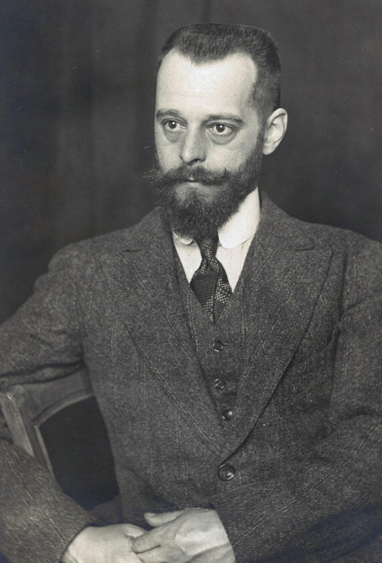
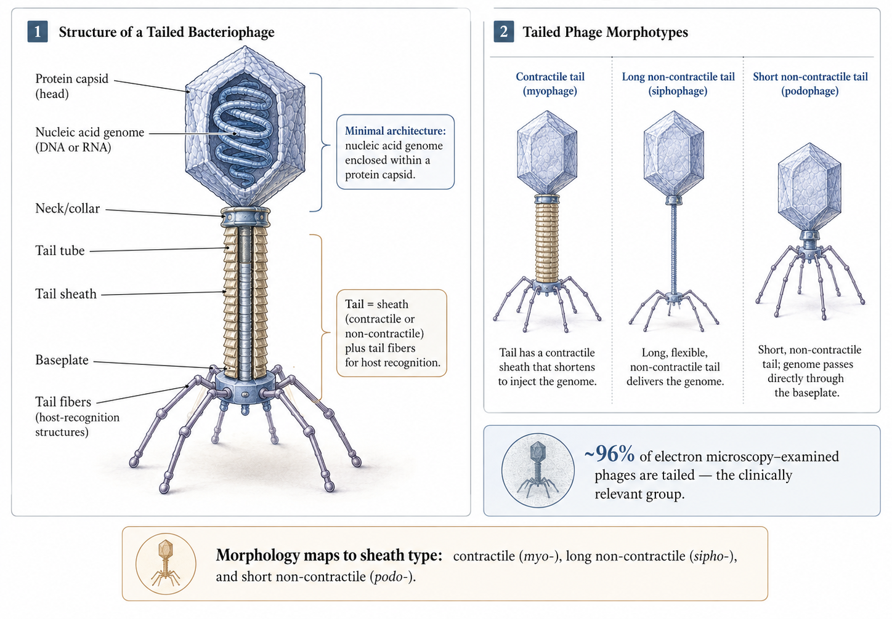
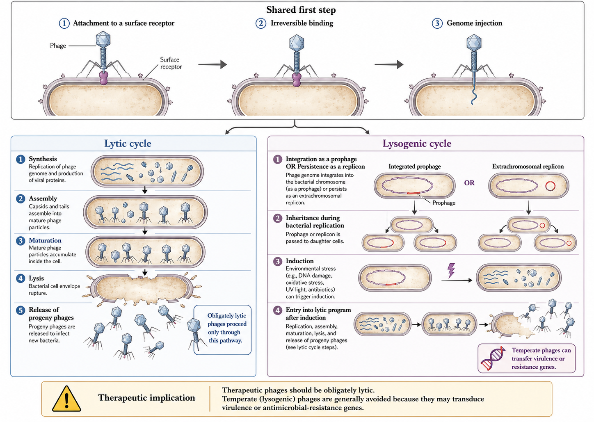
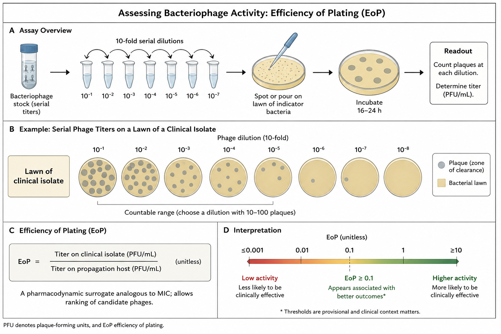
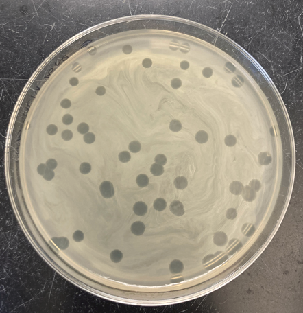
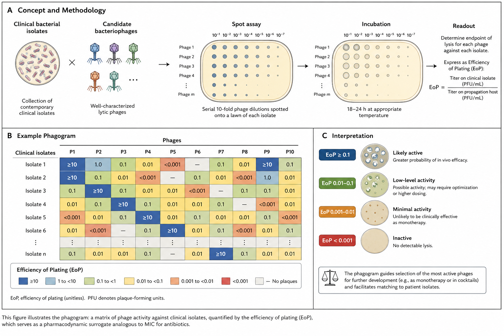
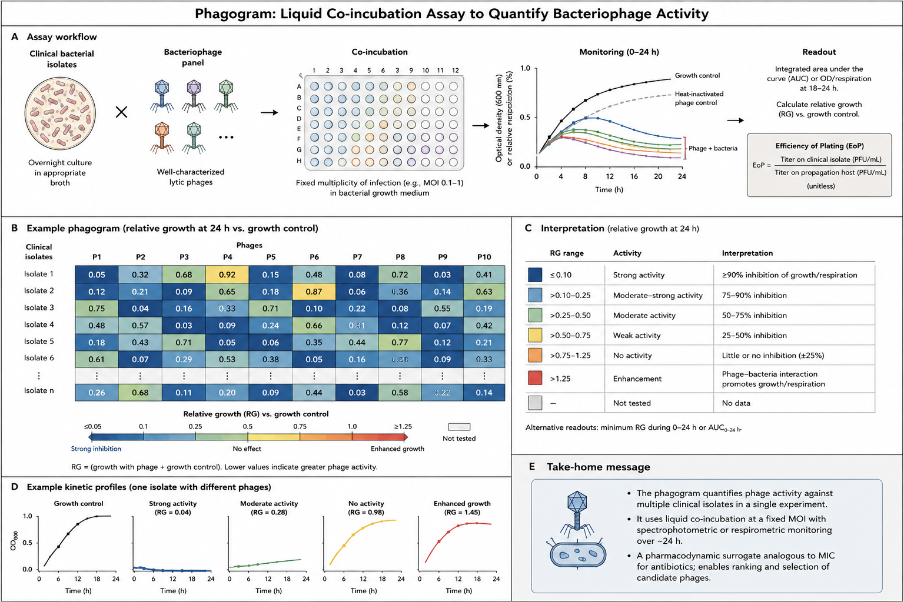
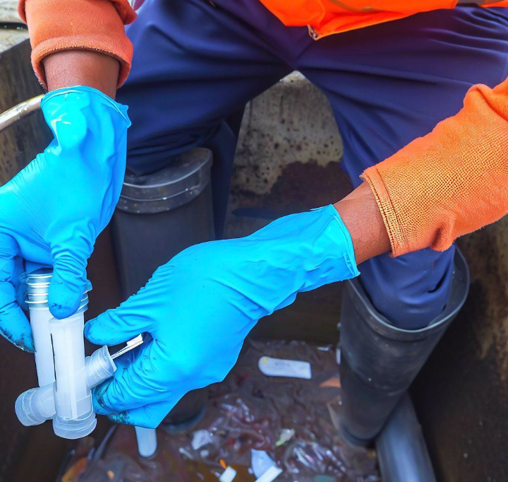
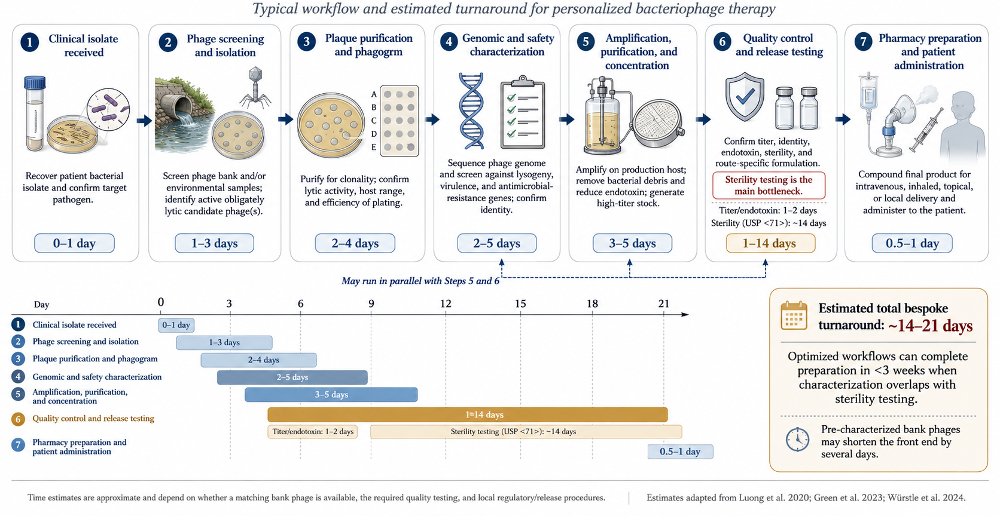

  
[Link to HTML slides](phage-slides.html)  
[Link to recorded lecture]()

::: {.callout-note}
## Learning objectives
By the end of this material, you should be able to:

- Explain the biology of obligately lytic versus temperate phages and why it dictates therapeutic suitability.
- Critically interpret phage susceptibility testing (plaque assay, EoP, phagogram) as a pharmacodynamic surrogate.
- Reason through phage PK/PD, immunogenicity, and phage–antibiotic interactions at the bedside.
- Appraise the disconnect between compassionate-use case reports and randomized trial data.
- Place endolysins, antimicrobial peptides, and monoclonal antibodies within the same "targeted biologic" antimicrobial framework.
:::

## Why alternative antimicrobials, and why now

The therapeutic problem is structural, not incidental. Before chemical antibiotics, infectious diseases caused roughly a third of deaths in the United States, with pneumonia, tuberculosis, and diarrhoeal disease leading the list; the "golden era" of antibiotic discovery (1950–1970) reversed this epidemiology [@Silver2011]. That era ended without a durable replacement pipeline: economic and scientific barriers have throttled new antibacterial class discovery while resistance has continued to rise [@Fair2014; @Silver2011]. The Global Burden of Disease analysis estimated that bacterial antimicrobial resistance was associated with approximately 4.95 million deaths in 2019, with 1.27 million directly attributable, and widely cited projections approach 10 million deaths annually by 2050 [@GBDAMR2022]. The clinical stakes are concrete: *Staphylococcus aureus* sepsis mortality fell from around 85% in the pre-antibiotic era to roughly 23% after antibiotics, but methicillin-resistant *S. aureus* bacteraemia mortality remains high [@Cosgrove2003].

This is the context in which bacteriophages, phage-derived enzymes, antimicrobial peptides, and monoclonal antibodies are being revived. Each is a *targeted biologic* — narrow-spectrum, manufactured, and mechanistically distinct from small molecules.

## Four platforms, one logic

| Platform | Nature | Self-replicating? | Spectrum | Principal niche today |
|---|---|---|---|---|
| Bacteriophages | Lytic virus | Yes | Strain-level | MDR / biofilm (adjuvant) |
| Endolysins | Phage-derived enzyme | No | Narrow–moderate | Gram-positive (emerging) |
| Antimicrobial peptides | Cationic peptide | No | Often broad | Local / engineered use |
| Monoclonal antibodies | Host-type IgG | No | Epitope-level | Prophylaxis / toxin neutralization |

: The targeted-biologic landscape {#tbl-platforms}

# A brief history of phage therapy

{#fig-dherelle fig-align="center" width="260"}

The observation of phage activity predates its understanding. In 1896 Ernest Hankin described an antibacterial "substance" in the Ganges and Jumna rivers that passed through filters and killed *Vibrio cholerae* [@Hankin1896], although later reanalysis questions whether phages were responsible given the environmental titres that would have been required [@Abedon2011]. Frederick Twort reported a transmissible lytic agent in 1915 [@Twort1915], and in 1917 Félix d'Hérelle provided unambiguous evidence of a replicating, bacteria-dependent organism, coining the term *bacteriophage* ("to devour bacteria") from filtered stool of patients recovering from shigellosis [@dHerelle1917]. d'Hérelle both discovered phages and rapidly applied them therapeutically, performing many of the earliest human treatments [@dHerelle1931].

{#fig-eliava fig-align="center" width="450"}

The rise of penicillin eclipsed phage therapy in the West. The narrow host range, limited pharmaceutical interest, and geopolitical factors shifted research toward chemotherapeutics [@Summers2012]. Crucially, phage therapy persisted in Eastern Europe and the former Soviet Union — most famously at the Eliava Institute in Tbilisi — where it is still administered [@Chanishvili2012]. The West instead adopted an "as-needed" assumption that new drug classes could always be discovered to outrun resistance, an assumption that has not held.

The modern resurgence is driven by AMR and by the recognition that phages offer a self-amplifying, self-limiting therapeutic drawn from an essentially inexhaustible, biodiverse resource of an estimated 10³¹ particles on Earth [@Mushegian2020; @Kortright2019]. High-profile compassionate-use successes — notably the 2017 intravenous phage cocktail treatment of Tom Patterson's disseminated *Acinetobacter baumannii* infection at UC San Diego — catalysed Western academic programmes and led directly to the founding of IPATH, the first dedicated US academic phage therapy center [@Schooley2017]. Whether the resurgence consolidates depends on translational PK/PD research and well-designed clinical trials, since enthusiasm currently outstrips controlled evidence.

# Phage biology

## Diversity, taxonomy, and structure

Phages are the most abundant biological entity on Earth. As of 2022 the International Committee on Taxonomy of Viruses recognised 1653 phage genera [@Walker2022], yet relatively few phages have been characterised: roughly 6300 examined by electron microscopy and around 14,200 sequenced, the majority carrying double-stranded DNA genomes [@Ackermann2012]. The historical morphology-based families *Siphoviridae*, *Myoviridae*, and *Podoviridae* have been reorganised by the ICTV, but the morphological vocabulary persists descriptively [@Walker2022; @Ackermann2012].

Architecturally, every phage contains at minimum a nucleic-acid genome encapsulated in a protein capsid [@Nobrega2018]. More than 96% of EM-examined phages are tailed, and tailed phages are the group under clinical investigation because they associate with clinically relevant bacteria and are the most readily isolated [@Ackermann2012]. The tail comprises a sheath — contractile or non-contractile — and tail fibres responsible for host recognition [@Nobrega2018]. Sheath morphology underlies the classical groupings: contractile (myovirus-like), long non-contractile (siphovirus-like), and short non-contractile (podovirus-like). The ICTV has since abolished *Siphoviridae*, *Myoviridae*, and *Podoviridae* as formal taxonomic families in its reclassification of the order *Caudovirales*, but the morphological terms remain pedagogically useful for describing sheath structure [@Walker2022].

{#fig-anatomy fig-align="center" width="700"}

## Life cycles and the therapeutic imperative of lysis

All phage replication begins with attachment to a surface receptor, followed by reversible then irreversible binding and genome injection [@Nobrega2018]. Adsorption is largely stochastic — phages are non-motile and rely on Brownian encounters — although phages have been observed to "walk" or "roll" across the bacterial surface to find an injection site [@Hu2013], and Ig-like capsid domains binding mucin produce subdiffusive motion that increases encounter frequency at mucosal surfaces [@Barr2013]. This is the basis of the bacteriophage adherence to mucus (BAM) model, in which phages displaying an immunoglobulin-like domain (such as Hoc in phage T4) adhere to mucin sugar chains, creating a localised zone of increased phage density that raises the odds an invading bacterium is intercepted before it reaches the underlying epithelium — a mucosal innate-immune-like layer with implications for oral and inhaled delivery [@Barr2013].

{#fig-lifecycle fig-align="center" width="600"}

After injection, the cycle diverges. In the **lytic cycle**, progeny phages are synthesised, assembled, and released by lysis; a phage that performs only this cycle is "obligately lytic" [@Hobbs2016]. In the **lysogenic cycle**, the genome integrates as a prophage (or persists as an independent replicon) and is inherited by daughter cells until induction triggers a lytic burst; such phages are "temperate" [@HowardVarona2017].

::: {.callout-important}
## Use obligately lytic phages
Therapeutic phages should be obligately lytic. Temperate phages risk lysogenic conversion — transfer of virulence or resistance genes to the host — which could make an infection more dangerous. Several major toxins (Shiga, cholera, diphtheria) are prophage-encoded [@Monteiro2019]. Sequencing to confirm a lytic lifestyle and the absence of toxin/integrase genes is mandatory before clinical use.
:::

# Spectrum of activity and in vitro susceptibility testing

Because host range is narrow, susceptibility cannot be assumed; phage activity must be tested against each clinical isolate, and where multiple strains of a species are present, against each strain [@Suh2022]. Phage therapy is consequently a personalised intervention best suited to monomicrobial infection; polymicrobial sites such as diabetic foot and intra-abdominal infection are more challenging [@Suh2022].

{#fig-eop fig-align="center"}

{#fig-plaque fig-align="center" width="450"}

The traditional assay is the **plaque assay**: a lawn of the clinical isolate is exposed to serial phage titres, producing zones of clearance (plaques). The **efficiency of plaquing (EoP)** — the titre producing plaques on the clinical isolate relative to the titre on the propagation host (the specific strain, typically the original isolation host or a standard reference strain, used to amplify a phage stock) — provides a quantitative susceptibility measure analogous to an MIC, allowing candidate phages to be ranked; an EoP of at least 0.1 appears associated with better outcomes, although thresholds remain provisional and are not standardised across laboratories, since plaque morphology, multiplicity of infection, and choice of propagation host all influence the result [@Suh2022].

Two complementary methods are the **dilutional spot test**, which compares candidate phages across dilutions on a single plate, and the **phagogram** (phage-induced bacterial growth-inhibition assay), which co-incubates fixed phage and bacteria and tracks optical density or respiration against a growth control over roughly 24 hours, mirroring the kinetics of broth microdilution MIC testing [@Suh2022; @Henry2012].

{#fig-spot fig-align="center"}

{#fig-phagogram fig-align="center"}

The phagogram is the most pharmacodynamically informative of these assays because it captures suppression over time, including regrowth from resistant subpopulations; higher-throughput readouts such as OmniLog respirometry enable rapid screening of many phage–isolate combinations [@Suh2022; @Henry2012].

Because phage therapy is usually combined with antibiotics, in vitro testing should also confirm absence of antagonism — ideally synergy — between the selected phage and antibiotic, and for biofilm indications should demonstrate anti-biofilm activity against the clinical isolate before administration [@Suh2022; @Doub2020biofilm]. Cocktails should be deliberately designed rather than assembled ad hoc [@Merabishvili2018].

# Bacterial resistance to phages

Resistance is the ecological norm. On a global scale, roughly 10²⁵ phage infections occur every second in the ocean, killing 20–40% of marine bacteria daily, which imposes enormous selective pressure and has produced layered anti-phage defences [@Suttle2007; @Brussaard2008; @Labrie2010]. Spontaneous phage-resistant mutants arise at frequencies around 10⁻⁵ (range 10⁻⁹–10⁻²) [@Filippov2011].

## Receptor modification and its therapeutic silver lining

The most common mechanism is alteration or loss of the phage-binding receptor [@Labrie2010]. Because these receptors are frequently virulence factors or components of porins and efflux systems, receptor changes can simultaneously shift antibiotic susceptibility [@Filippov2011], and phage-resistant mutants are frequently less virulent [@Chan2016; @GordilloAltamirano2021]. The canonical example is phage OMKO1 against *Pseudomonas aeruginosa*: resistance arises via alteration of the OprM efflux porin, which simultaneously restores sensitivity to ceftazidime and ciprofloxacin [@Chan2016]. The most common route to resistance may therefore yield bacteria that are easier to treat — the conceptual basis of phage steering (below).

## Abortive infection, CRISPR-Cas, and the pan-immune system

Beyond receptor changes, bacteria deploy abortive infection (altruistic suicide of the infected cell before progeny mature, consistent with kin selection) and CRISPR-Cas adaptive immunity, present in roughly 40% of sequenced bacteria, in which spacers guide Cas nucleases to phage DNA [@Labrie2010; @vanHoute2016; @Makarova2020]. Restriction-modification, cyclic-nucleotide signalling systems, and superinfection exclusion add further layers. At the patient level, however, pre-clinical screening of the actual isolate largely sidesteps these defences, because only phages already active against that isolate are deployed.

## Mitigation strategies

Resistance is mitigated by combining phages that use different receptors in precision-designed cocktails, by sequential therapy that rotates antigenically distinct phages, and by experimental "phage training" (coevolution) that pre-adapts phages and delays resistance [@Merabishvili2018; @Lusiak2014; @Borin2022]. Cocktails must be designed to avoid inter-phage antagonism arising from receptor competition or CRISPR upregulation [@Merabishvili2018].

# Manufacturing, logistics, and regulation

{#fig-sewage fig-align="center" width="450"}

Phage discovery draws on wastewater, environmental water, and other bacteria-rich sources. For ESKAPE pathogens a matching phage is often found quickly, but for rarer isolates the search may take months or fail [@Suh2022]. Candidate phages are sequenced and characterised to confirm an obligately lytic lifestyle and to exclude toxin, resistance, and integrase genes, then amplified on bacterial hosts to therapeutic titres [@Doub2021b; @Doub2021].

Because phages are grown on bacteria, manufacturing is fundamentally a contaminant-removal problem. Bacterial lysis releases endotoxin, which must be reduced below the FDA limit of 5 EU/kg/dose using ultrafiltration and affinity or ion-exchange chromatography [@Hietala2019]. Other risks — prophages, pathogenicity islands, toxins, and mobile genetic elements from the propagation host — are mitigated by amplifying on a genetically "clean" surrogate host (for *S. aureus*, *Staphylococcus carnosus* or strain RN4220) rather than the clinical isolate [@Doub2021b]. Sterility testing for residual live organisms is also required.

{#fig-timeline fig-align="center"}

::: {.callout-warning}
## Formulation is phage-specific
Phages can be stored frozen at −80 °C with glycerol, refrigerated, or lyophilised for ambient storage, with shelf lives of years under proper conditions [@Duyvejonck2021; @Puapermpoonsiri2010]. For use they are diluted in Plasma-Lyte, saline, or other fluids, but compatibility is phage-specific — a phage stable in one diluent may be inactivated in another, so retained activity must be confirmed in the chosen vehicle before administration [@Duyvejonck2021].
:::

In the United States phage therapy is not FDA-approved; outside trials, use is limited to compassionate cases after conventional failure, requiring a per-case emergency IND or expanded-access IND [@McCallin2019; @Suh2022]. There is likewise no EU-wide authorised human phage medicinal product under EU law. Emergency INDs can be granted rapidly once a phage is identified, whereas non-emergent approval may take around four weeks [@Suh2022]. In Europe, magistral preparation frameworks (notably Belgium) offer an alternative regulatory route for personalised products [@Fauconnier2019].

# Pharmacokinetics and pharmacodynamics

Phage PK departs from small-molecule principles because phages are large, proteinaceous, self-replicating, and immunologically active [@DabrowskaAbedon2019]. Concentration at the target can rise where bacteria are present (auto-dosing) and fall as bacteria clear, so "dose" is entangled with bacterial density, burst size, and adsorption rate.

- **Oral.** Proposed absorption occurs via transcytosis across epithelial tight junctions, limited by phage size [@Nguyen2017]. Phages are vulnerable to gastric pH below 6, mucins, and immune clearance; co-administration with an alkaline buffer mitigates gastric acidity [@Dabrowska2019]. Systemic absorption is inconsistent, although phages are recoverable in blood, urine, and tissue in a dose-dependent manner [@Dabrowska2019].
- **Intravenous.** Phages appear in the circulation soon after dosing and are cleared within 8–12 hours by the mononuclear phagocyte system, distributing to synovium, heart, muscle, marrow, kidney, and bladder; site concentrations are typically several-fold below the input titre, and IV dosing most strongly stimulates neutralizing antibody and complement [@Dabrowska2019].
- **Direct** (intra-articular, intravesical, intra-operative, topical). Bypasses the MPS to deliver higher local and lower systemic titres, and has been used in case reports for prosthetic joint infection (PJI), cardiac implantable electronic device (CIED, e.g., pacemaker/ICD) infection, osteomyelitis, and UTI; controlled-release systems (hydrogels, microencapsulation) are under study [@Totten2021; @Suh2022]. Direct delivery is particularly favoured for biofilm and device-associated infection because it bypasses MPS clearance and maximises local titre at a site where chance encounters with sessile bacteria are otherwise limiting.
- **Inhaled.** Aerosolised phages for respiratory infection can achieve high local doses, but lung-specific clearance and barriers remain to be defined [@Dabrowska2019].

Dosing is largely empirical, ranging from single doses to continuous infusion; a rare rational example is twice-daily IV dosing chosen because phage DNA was detectable in blood up to 12 hours after a dose [@Fabijan2020]. The Antibacterial Resistance Leadership Group (ARLG) Task Force recommends the highest safe, tolerated dose with endotoxin below limits, repeat dosing to maximise site concentrations, and frequently multi-route administration [@Suh2022]. The Task Force's ideal PK/PD profile combines high microbial susceptibility, high site concentration, high adsorption rate, large burst size, and short latent period, while acknowledging that standardised methods to measure these in vivo do not yet exist [@Suh2022].

# Immunogenicity: the neutralizing antibody response

Phages are live viruses and elicit IgM within weeks followed by IgG [@Lusiak2014]. Neutralizing antibodies can sharply reduce phage titres and have correlated with clinical failure [@Dedrick2021]. Cocktails do not solve this problem, because antibodies form against all component phages and can cross-react [@Lusiak2014]; sequential therapy with antigenically distinct phages can outpace the response, though narrow inventories limit cycling. The response is route-dependent: IV elicits the most robust humoral response, while oral and direct administration elicit less, with neutralizing titres rising as systemic absorption increases [@Lusiak2014]. Autoimmune phenomena are theoretical and have not been described with phage therapy [@Smatti2019]. Notably, not all prolonged courses generate neutralizing titres, and the host–phage interactions that determine this are an active research area [@Cano2021].

# Therapeutic phage interactions

Phage–antibiotic combinations can be synergistic, antagonistic, or neutral [@Gu2022]. As a general rule, cell-wall-active antibiotics tend toward synergy while protein-synthesis inhibitors are more prone to antagonism [@Gu2022; @Comeau2007PAS]. The phenomenon of phage–antibiotic synergy (PAS) describes sub-MIC β-lactams and quinolones stimulating virulent phage production, plausibly via cell-wall-stress filamentation that increases burst size [@Comeau2007PAS]; synergy depends on both mechanism and stoichiometry [@Gu2022]. Antagonism is exemplified by colistin combined with LPS-binding phages: colistin destabilises LPS, the receptor the phage requires, reducing infection [@DanisWlodarczyk2021]. Burst size, pH, viscosity, and fluid dynamics further modulate interactions, so the specific phage–antibiotic pair must be tested in vitro rather than predicted [@DanisWlodarczyk2021; @Gu2022]. Phages can also interfere with one another through receptor competition and CRISPR upregulation, reinforcing the case for precision-designed cocktails [@Merabishvili2018].

# Safety

The overall safety profile is reassuring across preclinical, case-report, and phase I/II data, and the FDA has granted GRAS status to certain phage applications [@Liu2021; @FDAGRAS]. The ecological argument is strong — phages are part of the human gut virome and are ingested in large numbers daily [@Townsend2021] — but the ARLG nonetheless recommends interval monitoring of renal function, liver function, and complete blood count during therapy [@Suh2022].

Mechanistically, adverse events arise from endotoxin and bacterial-debris release during rapid lysis, triggering proinflammatory cytokine responses; from contaminants such as bacterial DNA, enterotoxins, exotoxins, and lipoteichoic acid causing hypersensitivity or cytokine release; and from manufacturing residues such as caesium chloride and polyethylene glycol [@Liu2021]. In practice, preclinical studies show phages to be generally well tolerated, with only occasional transient cytokine or antibody rises [@Liu2021]. Case reports describe mostly absent or transient events — transient hypotension, fevers and chills, wheeze, flushing, and nausea — including a self-limited IL-6/IL-8 cytokine storm resolving within a day [@Aslam2019]. Transient transaminitis has been observed with intravenous and intra-articular dosing, reversible and generally not outcome-limiting, but warranting LFT monitoring particularly in pre-existing liver disease [@DoubWilson2021].

# Phages against multidrug-resistant infections

Antibiotic resistance does not confer phage resistance, because phages target surface receptors rather than antibiotic targets [@Kortright2019]. Most case reports use phages in combination with antibiotics rather than as monotherapy, and phages exert less collateral pressure on the microbiome than broad-spectrum antibiotics [@Schooley2017; @Aslam2019]. Efficacy in MDR infection, however, will be established only by prospective trials [@Suh2022].

A particularly elegant strategy is **phage steering**, in which phage predation selects for a more antibiotic-susceptible phenotype [@Gurney2020]. In *Pseudomonas aeruginosa*, selection for phage resistance via efflux/porin changes restores susceptibility to antibiotics including agents not normally used against the organism, such as tetracyclines [@Chan2016; @Gurney2020]; analogous trade-offs are described in *Klebsiella pneumoniae* and *Acinetobacter baumannii*, where phage resistance entails loss of capsule or multidrug resistance and re-sensitisation [@Majkowska2021; @GordilloAltamirano2021]. Steering reframes the therapeutic goal: bending the bacterial population back into the reach of an inexpensive antibiotic, rather than requiring the phage to clear the infection outright.

# Biofilm infections

Most bacteria live in sessile biofilm states rather than planktonically, and phages have evolved to infect biofilm-embedded bacteria [@Doub2020biofilm]. Certain phages encode depolymerases and endolysins that enzymatically degrade the extracellular polymeric matrix, and the confined biofilm environment can increase chance phage–bacteria encounters, allowing piecemeal degradation [@ChanAbedon2015; @Doub2020biofilm]. Depolymerase-mediated matrix degradation is a distinctive advantage over antibiotics, which often simply fail to penetrate.

Delivery is decisive. Direct administration reduces biofilm, whereas systemic administration frequently fails to reach device-associated biofilm: in a murine prosthetic-joint model, intraperitoneal phage synergised with vancomycin against planktonic bacteria in tissue but did not reduce biofilm on the implant [@Morris2019]. Because phages are non-motile, chance encounters with sessile bacteria must be maximised by direct delivery, which also circumvents MPS clearance [@Doub2020biofilm]. Clinical case series support phages as a powerful adjuvant in recalcitrant biofilm infection [@Ferry2018].

# Clinical trials: the reality check

Numerous case reports show promise across syndromes and pathogens — for example, favourable responses in 11 of 20 compassionate-use patients with drug-resistant mycobacterial disease, predominantly *Mycobacterium abscessus* [@Dedrick2022; @Schooley2017]. Controlled trials, however, have not reproduced these outcomes. Since 2000, 13 English-language phage-therapy trials have been published, of which six assessed efficacy [@Stacey2022].

| Study (year) | Indication | Design | Efficacy result |
|---|---|---|---|
| Wright (2009) | Chronic *P. aeruginosa* otitis | Randomised, double-blind, placebo-controlled | Positive [@Wright2009] |
| Rose (2014) | Colonised burn wounds | Self-controlled case series | Null [@Rose2014] |
| Sarker (2016) | Paediatric *E. coli* diarrhoea | Randomised, placebo-controlled | Null [@Sarker2016] |
| Jault / PhagoBurn (2019) | Burn wound *P. aeruginosa* | Randomised controlled | Inferior (under-dosed) [@Jault2019] |
| Leitner (2021) | UTI before TURP | Randomised, double-blind, three-arm | Null [@Leitner2021] |

: Efficacy-focused phage clinical trials {#tbl-trials}

The single rigorous positive trial, **Wright 2009**, used a six-phage cocktail with confirmed susceptibility testing in chronic *P. aeruginosa* otitis and showed improved clinical scores and lower bacterial counts versus placebo [@Wright2009]. The instructive failures share design flaws: **Rose 2014** used a fixed, non-personalised cocktail without prospective susceptibility testing and reported run-off of the topical spray [@Rose2014]; **Sarker 2016** used oral coliphages without susceptibility testing and found no efficacy or intestinal amplification [@Sarker2016]. **PhagoBurn (Jault 2019)** is the cautionary chemistry-manufacturing-and-controls tale: storage reduced the delivered titre far below intent, so an under-dosed product was slower than standard-of-care antiseptic [@Jault2019]. **Leitner 2021**, methodologically the strongest neutral trial, found intravesical phages neither superior to placebo nor non-inferior to antibiotics for UTI [@Leitner2021]. Ongoing and NIH-funded adaptive trial designs (e.g., the CYPHY programme) aim to test phages under conditions closer to the case-report standard — personalised, susceptibility-confirmed, adequately dosed — and will be the next test of whether the field's current consensus holds.

::: {.callout-tip}
## The pattern is diagnostic
The negative trials largely violated the principles the case reports followed — personalisation, susceptibility testing, adequate dosing, and effective local delivery. The failures are therefore as much about trial design and manufacturing as about phage biology, which is why the defensible current use is adjunctive, personalised, well-delivered phage therapy for recalcitrant MDR or biofilm infection, pending better trials [@Stacey2022; @Suh2022].
:::

# Endolysins

Endolysins are phage-derived enzymes that hydrolyse peptidoglycan, causing osmotic lysis, and fall into three classes — glycosidases, amidases, and endopeptidases [@Rahman2021]. Gram-positive endolysins combine an N-terminal catalytic domain with a C-terminal cell-wall-binding domain, whereas Gram-negative endolysins are globular without a discrete binding domain [@Rahman2021]. Exogenously applied endolysins reach peptidoglycan readily in Gram-positives, whose thick peptidoglycan is exposed, but the Gram-negative outer membrane blocks access; this is overcome with permeabilisers such as EDTA or by engineering — "Artilysins" and receptor-binding-protein fusions that translocate the enzyme across the outer membrane [@Loessner2005; @Rahman2021; @Zampara2020].

Endolysins offer two pharmacological advantages over phages: resistance is less likely because peptidoglycan bonds are highly conserved and difficult to alter, and their PK is more conventional because they are defined proteins rather than replicating particles [@Rahman2021]. The trade-off is the loss of self-amplification. They can still elicit anti-protein antibodies, although routine human exposure tempers immunogenicity [@Mirski2019].

Clinically, the staphylococcal endolysin **SAL200** was well tolerated up to 10 mg/kg IV in phase I (mild fatigue/myalgia only) [@Jun2017]; topical **Staphefekt** improved symptoms in atopic dermatitis in a placebo-controlled trial [@Moreau2018]; and **exebacase (CF-301)** shows in vitro synergy with anti-staphylococcal antibiotics [@Watson2020]. However, the phase III DISRUPT programme evaluating exebacase for *S. aureus* bacteraemia and right-sided endocarditis was stopped for futility at interim analysis [@Fowler2020] — a reality check mirroring the phage-trial experience. Gram-positive endolysins for bone-and-joint infection and bacteraemia remain the most plausible near-term applications, while Gram-negative endolysins require further engineering.

# Antimicrobial peptides

Antimicrobial peptides (AMPs) are small (usually fewer than 100 amino acids), typically cationic, amphipathic molecules that act primarily by disrupting the cytoplasmic membrane, with additional inhibition of nucleic-acid, protein, and cell-wall synthesis, and frequently possess immunomodulatory properties [@Brogden2005; @Hancock2006]. Phage-encoded AMPs are grouped into non-enzymatic lytic factors and tail-complex proteins; protein E of bacteriophage φX174, which inhibits the MraY translocase in peptidoglycan synthesis, is a classic example [@Mendel2006]. Some phage-derived AMPs can penetrate the Gram-negative outer membrane, an attractive property under active pharmaceutical development [@Mirski2019].

Despite their breadth and biofilm activity, AMP development has historically been limited by toxicity, suboptimal PK, and weak in vivo activity [@Deslouches2020]. Engineered peptides that mimic endogenous AMPs (engineered cationic antimicrobial peptides, eCAPs) are reviving the field: the engineered AMP **PLG0206** showed linear PK and good tolerability after a single intravenous dose in phase I and has advanced to a phase II study in acute prosthetic joint infection [@Huang2022PLG; @Deslouches2020].

| Feature | Phages | Endolysins | AMPs |
|---|---|---|---|
| Self-replicating | Yes | No | No |
| Spectrum | Strain-narrow | Narrow–moderate | Often broad |
| Gram-negative use | Yes | Difficult (needs engineering) | Some natively |
| Resistance barrier | Low–moderate | High | Variable |
| PK predictability | Low | Higher | Variable |

: Phage-derived antibacterial platforms compared {#tbl-derived}

# Monoclonal antibodies as antimicrobial agents

## Rationale, history, and mechanisms

Antibody-based anti-infectives predate antibiotics: serum therapy for diphtheria and pneumococcus was standard in the 1890s–1930s before being displaced by small molecules [@Zurawski2020]. Monoclonal antibodies (mAbs) revive the approach for the same reason as phages — antimicrobial resistance and unmet niches [@Motley2018]. A mAb is a defined, host-type IgG targeting a single epitope; like a phage it is a narrow-spectrum, manufactured biologic, but it acts by recruiting host immunity or neutralizing a target rather than by direct lysis.

Anti-infective mAbs work through four broad mechanisms: toxin neutralization (binding and inactivating a toxin without bactericidal effect); neutralization of attachment or entry (blocking a receptor interaction); Fc-mediated opsonophagocytosis and antibody-dependent cellular cytotoxicity; and complement-dependent cytotoxicity [@Zurawski2020]. A conceptually important observation for trainees is that the clinically successful anti-infective mAbs are predominantly *neutralizers* — of toxins or viruses — rather than direct bacterial killers.

::: {.callout-note}
## Engineering the molecule
Formats evolved from murine through chimeric to humanised and fully human antibodies to reduce immunogenicity. Fc engineering tunes effector function, and half-life-extension mutations — notably the YTE (M252Y/S254T/T256E) substitutions that increase FcRn binding — extend half-life to roughly 70 days, enabling the single-dose, season-long prophylaxis seen with nirsevimab [@Hammitt2022]. Exquisite specificity is the platform's strength and its weakness: it confers precise targeting but no breadth and vulnerability to antigenic change.
:::

## Approved and instructive agents

**Bezlotoxumab** is a human mAb against *Clostridioides difficile* toxin B; it does not kill the organism but neutralizes the toxin. In the MODIFY I/II trials, added to standard-of-care antibiotics, it reduced recurrent CDI to roughly 17% versus about 28% with placebo, leading to FDA approval in 2016 for prevention of recurrence in high-risk adults; a heart-failure exacerbation signal was observed in patients with congestive heart failure [@Wilcox2017].

**Ibalizumab** is a humanised mAb binding CD4 domain 2 that blocks HIV-1 entry after attachment (a post-attachment inhibitor). Approved in 2018 for multidrug-resistant HIV-1 and dosed intravenously every two weeks, the phase III TMB-301 study showed a ≥1 log₁₀ viral-load reduction in 83% of patients at day 7, with roughly 43% achieving fewer than 50 copies/mL by week 25; its resistance mechanism does not overlap with small-molecule antiretrovirals [@Emu2018].

**Raxibacumab** and **obiltoxaximab** both target anthrax protective antigen to block toxin assembly and entry, and were approved for inhalational anthrax (raxibacumab in 2012, obiltoxaximab in 2016) [@Migone2009; @Greig2016]. Both were approved under the FDA Animal Rule — efficacy demonstrated in animal models because human efficacy trials are neither ethical nor feasible — and serve as stockpiled medical countermeasures; neither is authorised by the EMA, and obiltoxaximab's approval was subsequently withdrawn.

RSV prophylaxis is the platform's clearest success. **Palivizumab**, an anti-RSV F-protein mAb dosed monthly, reduced RSV hospitalisation by about 55% in high-risk infants in the IMpact-RSV trial [@IMpactRSV1998]. **Nirsevimab**, a YTE half-life-extended anti-F mAb given as a single dose per season, reduced medically attended RSV lower-respiratory-tract infection by roughly 75% in the MELODY trial and RSV hospitalisation by about 83% in the pragmatic HARMONIE trial, extending prophylaxis from high-risk infants to all infants [@Hammitt2022; @Drysdale2023].

**Anti-SARS-CoV-2 mAbs** provide the defining cautionary tale. **Sotrovimab** reduced hospitalisation or death by about 79% in early high-risk COVID-19 in COMET-ICE [@Gupta2021], and casirivimab/imdevimab, bamlanivimab, and tixagevimab/cilgavimab were widely deployed, but their authorisations were withdrawn as Omicron sublineages escaped neutralization. A single-epitope agent can be rendered obsolete by one mutation — directly analogous to phage resistance via receptor change, and the reason both fields turn to combinations and breadth.

## The antibacterial mAb graveyard and why it persists

Against whole bacteria, mAbs have repeatedly failed despite strong preclinical data. **Suvratoxumab**, an anti-*S. aureus* α-toxin mAb, lowered ventilator-associated pneumonia incidence numerically but did not meet its primary endpoint in the SAATELLITE trial [@Francois2021]. **Gremubamab (MEDI3902)**, a bispecific anti-*P. aeruginosa* PcrV/Psl antibody, did not reduce *P. aeruginosa* pneumonia in the EVADE trial [@Chastre2022]. No antibacterial mAb is FDA-approved for treating bacterial infection; the successes remain toxin neutralization (bezlotoxumab) and prophylaxis.

The reasons are instructive: bacterial virulence is redundant, so neutralizing a single factor rarely suffices; single-epitope targeting is fragile against antigenic variation; mAbs work best as prophylaxis and poorly as rescue in established sepsis or biofilm; and, unlike phages, a fixed dose cannot self-amplify to follow the bacterial burden [@Zurawski2020; @Chastre2022]. This is precisely the property phages possess and fixed-dose mAbs lack — while mAbs enjoy the mature manufacturing and regulatory path that phages still lack.

# Synthesis and future directions

## Phages and monoclonal antibodies as complementary biologics

| Dimension | Bacteriophages | Monoclonal antibodies |
|---|---|---|
| Mechanism | Direct lysis plus amplification | Neutralization / Fc effector functions |
| Self-amplifying | Yes | No |
| Spectrum | Strain-level | Epitope-level |
| Principal use today | Established MDR/biofilm (adjuvant) | Prophylaxis / toxin neutralization |
| Resistance / escape | Receptor change | Antigenic variation |
| Manufacturing / regulatory | Immature, personalised | Mature, standardised |

: Two targeted biologic antimicrobials {#tbl-vs}

Both phages and mAbs are narrow, biologic, manufactured anti-infectives revived by AMR, and their weaknesses are mirror images: phages are biologically powerful but operationally immature, while mAbs are operationally mature but biologically limited against whole bacteria [@Suh2022; @Zurawski2020].

## Where the field is heading

Engineering is expanding phage host range through tail-fibre mutagenesis and synthetic or CRISPR-armed phages [@Yehl2019]. Phage steering and phage–antibiotic synergy are being integrated into rational, antibiotic-sparing regimens [@Gurney2020; @Gu2022]. The field needs standardised PK/PD and susceptibility methods and adaptive, personalised trial designs [@Suh2022], and the future is likely combinatorial — phages with endolysins and antibiotics, and mAb cocktails to counter antigenic escape [@Pirnay2020]. Regulatory innovation, such as Belgium's magistral model and adaptive FDA frameworks, may prove as decisive as the biology for whether phages reach routine practice.

## Take-home messages

1. Use obligately lytic, susceptibility-confirmed phages, and screen every clinical isolate.
2. Phage PK/PD is non-classical — self-amplification, MPS clearance, neutralizing antibody, and route-dependent delivery all matter.
3. Case reports outrun controlled evidence; design failures (no susceptibility testing, fixed cocktails, under-dosing, poor delivery) explain most negative trials.
4. Endolysins, AMPs, and monoclonal antibodies complete a spectrum of targeted biologics — mAbs excel at prophylaxis and toxin neutralization, phages at established MDR and biofilm infection.

# References {.unnumbered}

::: {#refs}
:::
